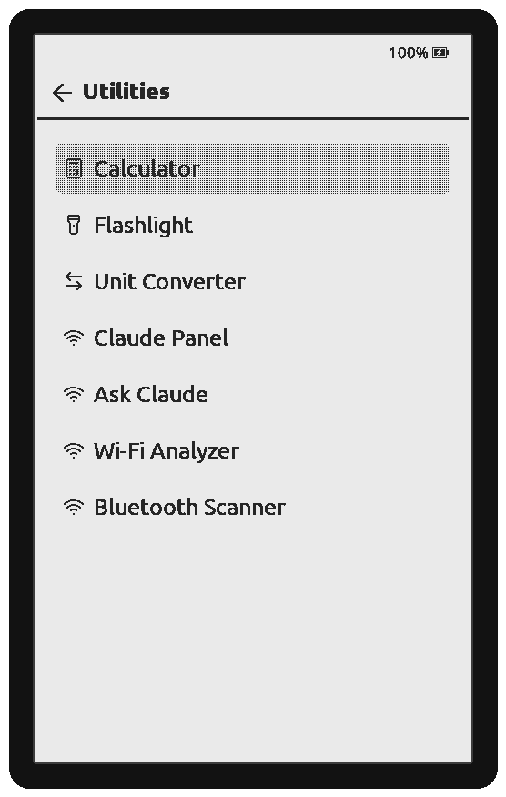
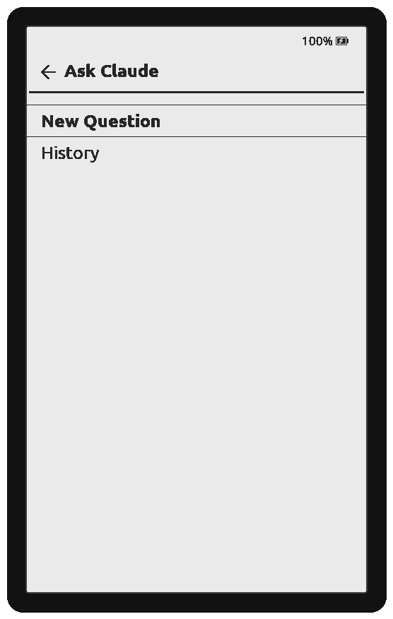

<p align="center">
  
</p>

<h1 align="center">CrossLight</h1>

<p align="center">
  <strong>A personal fork of CrossPoint e-reader firmware, for the Xteink X4 Pro.</strong><br>
  The upstream reader, plus a Bible study suite, a few Claude-powered tools,<br>
  handy utilities, and a passive Wi-Fi/BLE toolkit — all on one e-ink device.
</p>

<p align="center">
  
  
  
  
  
</p>

<p align="center">
  <a href="#install">Install</a> •
  <a href="#what-crosslight-adds">What's added</a> •
  <a href="#whats-actually-working">Status</a> •
  <a href="#build-it-yourself">Build</a> •
  <a href="https://github.com/flyboy-byte/crosslight/releases">Downloads</a> •
  <a href="PLAN.md">PLAN.md</a>
</p>

---

> [!NOTE]
> **This is a personal fork, not an upstream project.** CrossLight tracks
> [CrossPoint](https://github.com/crosspoint-reader/crosspoint-reader) and merges from it regularly;
> everything the reader does, CrossPoint built. This fork adds a Bible suite, some utilities, and a
> security toolkit on top, targeting one device (the Xteink X4 Pro) specifically. Most of the code,
> docs, and this README were written with [Claude Code](https://claude.com/claude-code); I direct it,
> test on real hardware, and make the calls. Not affiliated with or endorsed by the CrossPoint project.

## The short version

[CrossPoint](https://github.com/crosspoint-reader/crosspoint-reader) is an open-source e-reader
firmware for Xteink devices — a genuinely good EPUB reader with a library, wireless file transfer,
themes, and 34 languages. **CrossLight** is my fork of it, pinned to the **X4 Pro** (ESP32-S3, 16 MB
flash, 8 MB PSRAM, touch, dual frontlight), that bolts on a few things the upstream reader doesn't
have: a **Bible study suite**, a small set of **utilities**, a few **Claude-powered reading tools**,
and a **passive Wi-Fi/BLE toolkit** for personal security research. Updates install over Wi-Fi from
this repo's releases.

## What CrossLight adds

Everything in CrossPoint is still here (it's merged in, not replaced). On top of it:

- **Bible reader** — downloadable translations stored on the SD card, full-text search, bookmarks,
  cross-references.
- **Memory Work** — structured verse-memorization courses and lessons.
- **Bible Numbers** — short studies on the numbers in Scripture (7, 12, 40, 666 …), every claim
  tagged by evidence strength (`FACT` / `LITERARY PATTERN` / `TRADITION` / `DEBATE` / `SPECULATION`)
  so interpretation is never dressed up as settled fact.
- **Utilities** — a calculator, a flashlight (drives the frontlight to full), and a unit converter
  (length / mass / temperature / volume / speed).
- **Claude-powered reading tools** — a Claude Panel utility (live 5h/7d usage), Ask Claude (a
  free-prompt utility with on-SD question history), and Bible Passage Q&A (ask about whatever
  passage is on screen, right from the reader's menu). All three go straight from the device to
  Anthropic over your own subscription token — no bridge, no third-party server in between.
- **Passive Wi-Fi/BLE toolkit** — Wi-Fi Analyzer and a Bluetooth Scanner with vendor labeling are
  on by default; everything else (evil-twin / deauth-flood detection, PCAP capture, EAPOL/PMKID
  capture with hashcat-22000 export) is compiled in but hidden unless an empty flag file is placed
  on the SD card. See [the toolkit note](#about-the-wi-fible-toolkit) below.

<p align="center">
  
  
</p>
<p align="center"><sub>Captured in the desktop simulator, not real hardware — tinted and framed to
read a little less like a bare SDL window. See <a href="#build-it-yourself">Build it yourself</a>.</sub></p>

---

## What's actually working

Honest status — what's been run on real hardware, versus what builds clean but hasn't been flashed yet.

| | Feature | Notes |
|---|---|---|
| ✅ | **CrossPoint reader core** | Inherited from upstream and running on the X4 Pro — EPUB/TXT/XTC, library, wireless, themes, OTA. Re-synced to upstream regularly. |
| ✅ | **Bible reader + Memory Work** | Shipped and in use on-device. Translations load from the SD card. |
| ✅ | **Bible Numbers** | Shipped (26.9.3). Study data lives in `/Bible/numbers/` on the SD card. |
| ✅ | **Historical Calendar + Daily Psalter** | Shipped (26.10.3) — Easter computus and the 1611 KJV's monthly reading calendar. |
| ✅ | **Compare Translations** | Read a verse across every installed translation, from the Bible reader's menu. Shipped (26.10.4); page-turn-button and verse-position fixes on top, built and green. |
| ✅ | **Claude Panel + Ask Claude** | **Confirmed working on real hardware** (26.10.9) — usage fetch and free-prompt Q&A both tested end-to-end over the real device's Wi-Fi. |
| 🚧 | **Bible Passage Q&A** | Shares the same Claude client as the two above; its TLS handshake is confirmed on-device, but the full ask-a-verse flow hasn't been independently re-tested since the last model swap. |
| ✅ | **Calculator** | Shipped on-device. (An operator-on-display fix is built and waiting for the next release.) |
| 🚧 | **Flashlight + unit converter** | Built; green on host tests, simulator, and the device build. **Not yet flashed / tested on hardware.** |
| 🚧 | **Passive Wi-Fi/BLE scanners** | Wi-Fi Analyzer and Bluetooth Scanner, on by default. BLE fingerprinting needs `signatures.json` on the SD card to label anything, and full RF/SD-write correctness isn't exhaustively verified yet. |
| 🚧 | **Active/transmit toolkit** | Evil-twin, beacon flood, PCAP/EAPOL/PMKID capture, the Flock/camera scanner — compiled in, but **hidden from the menu** unless the SD card has an empty `/offensive/enabled` flag file. Paused as active development, kept working. |

> [!TIP]
> `PLAN.md` is the living design doc — current state, decisions, and what's next, in far more detail
> than this README.

---

## Install

The X4 Pro checks **this** repo for updates (not upstream's), so once you're on CrossLight you stay on it.

| Method | When | How |
|---|---|---|
| **Wi-Fi OTA** | Already on CrossLight 26.9.2+ | Settings → Check for Updates. Installs the latest [release](https://github.com/flyboy-byte/crosslight/releases). |
| **SD card** | Coming from stock / another firmware | Drop `crosslight-<version>-x4pro.bin` on the SD card, then Settings → SD Card Firmware Update. |
| **Wired flash** | First install, or a partition-table change | `pio run -e x4pro -t upload` over USB (USB-A-to-C cable). |

> [!IMPORTANT]
> Back up your stock firmware before first flashing. Grab the matching `crosslight-<version>-x4pro.bin`
> from [Releases](https://github.com/flyboy-byte/crosslight/releases) — the `x4pro` tag matters, the
> updater refuses an image built for another board.

---

## How it works

CrossLight is layered on top of CrossPoint and the FreeInk SDK — the fork only adds the top band:

```
┌─ CrossLight (this fork) ───────────────────────────────┐
│  Bible reader · Memory Work · Bible Numbers/Calendar   │
│  Utilities: calculator · flashlight · unit converter   │
│  Claude Panel · Ask Claude · Bible Passage Q&A         │
│  Wi-Fi/BLE analysis (passive by default; active=gated) │
├─ CrossPoint reader core (upstream, merged & tracked) ──┤
│  EPUB/TXT/XTC · library · wireless · themes · OTA      │
├─ freeink-sdk (HAL · display · radio · TLS · fonts) ────┤
└─ Xteink X4 Pro — ESP32-S3 · 16 MB flash · 8 MB PSRAM ──┘
```

New Home-reachable tools plug into one registry (`src/utilities/UtilityRegistry.cpp`) — a tile is one
include plus one line, so the upstream-hot `HomeActivity` never has to change. Feature data that would
bloat the firmware (Bible translations, number studies, BLE signatures) lives on the SD card, not in
flash.

---

## Build it yourself

<details>
<summary><b>Firmware build (PlatformIO)</b></summary>

<br>

```sh
git clone https://github.com/flyboy-byte/crosslight.git
cd crosslight
git submodule update --init --recursive   # pulls freeink-sdk
pio run -e x4pro                           # build
pio run -e x4pro -t upload                 # flash over USB
```

The release image is a plain `pio run -e x4pro`; the binary lands at
`.pio/build/x4pro/firmware.bin`. Version lives in `platformio.ini` under `[crosslight]`.

</details>

<details>
<summary><b>Desktop simulator (build UI without hardware)</b></summary>

<br>

CrossLight builds natively against the [CrossLight Simulator](https://github.com/flyboy-byte/crosslight-simulator)
(a fork of the CrossPoint simulator) and renders an X4 Pro window via SDL2. It does **not** emulate
the radio (Wi-Fi/BLE) or true e-ink timing — those need the real device.

```sh
sudo pacman -S sdl2 openssl          # or your distro's equivalent
pio run -e simulator_x4_pro          # config lives in gitignored platformio.local.ini
```

</details>

<details>
<summary><b>Host tests</b></summary>

<br>

Pure logic (Bible parsing, number-study loading, Wi-Fi/BLE frame parsing, conversions) is covered by
a GoogleTest suite that runs on the host. Needs the `freeink-sdk` submodule checked out (see the
firmware build above):

```sh
cmake -S test -B build/test -G Ninja -DCMAKE_BUILD_TYPE=Release
cmake --build build/test
ctest --test-dir build/test --output-on-failure -j
```

</details>

---

## About the Wi-Fi/BLE toolkit

This is personal security-research tooling for **my own hardware**, in the Hak5 / DEFCON spirit — the
same way an SDR or a Hak5 device is lawful to own and use on gear you control. Only **Wi-Fi
Analyzer** and **Bluetooth Scanner** — passive, receive-only, legally unambiguous — show up in the
menu by default. Everything else (evil-twin, beacon flood, PCAP/EAPOL/PMKID capture, the camera
scanner) is paused as active development: still compiled in, but hidden behind an empty
`/offensive/enabled` flag file on the SD card, and scoped to equipment I own — never shared, campus,
or other people's networks. Signature/OUI data is verified against primary sources, never fabricated.

---

## Repo layout

| Path | What |
|---|---|
| `src/activities/bible/` | Bible reader, Memory Work, Numbers UI |
| `src/bible/` | Bible data engines (SD-backed, host-tested) |
| `src/activities/utilities/` + `src/utilities/` | Utility tiles + the registry |
| `src/claude/` | Shared Claude HTTP/auth client, used by all three Claude-powered tools |
| `src/wifiaudit/`, `src/bleaudit/`, `src/offensive/` | Wi-Fi/BLE toolkit — passive (always on) and active (SD-flag gated) |
| `freeink-sdk/` | Upstream HAL/display/radio SDK (submodule) |
| `PLAN.md` | Living design doc — read this first |

## License & credit

MIT, inherited from [CrossPoint](https://github.com/crosspoint-reader/crosspoint-reader). CrossLight
exists only because CrossPoint is open and hackable — all credit for the reader to the CrossPoint
community. If you're buying an Xteink device, consider a Developer Edition through
[crosspointreader.com](https://crosspointreader.com) to support upstream.
